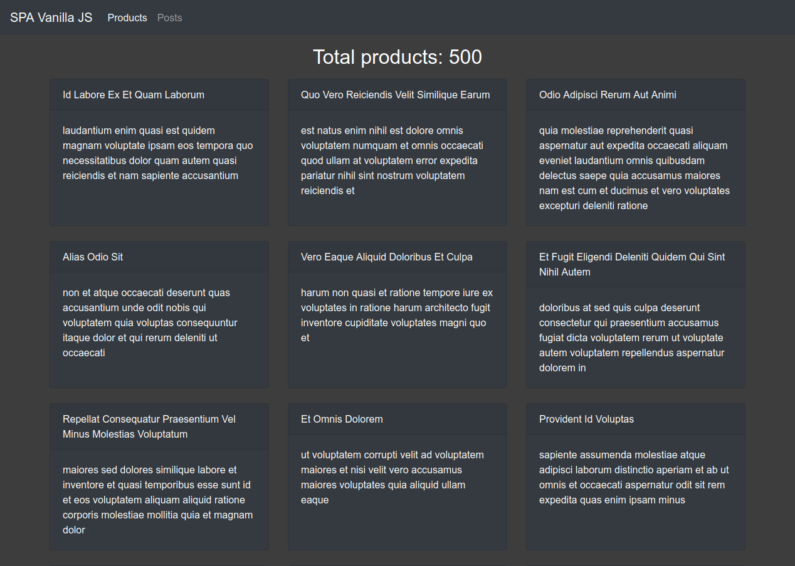
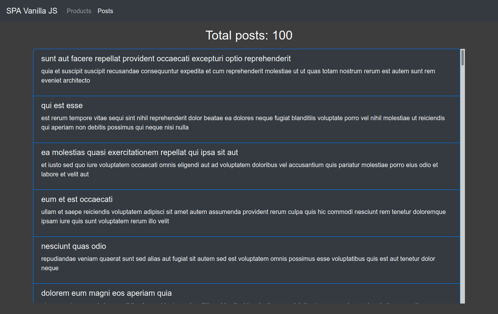

# Single Page Application con Vanilla JavaScript

Applicación desarrollada con el metodo vanilla javascript con NodeJS usando Webpack.  
Basado en el tutorial de [Fazt Code](https://www.youtube.com/watch?v=D9avX-jtIPM)

## Webpack plugins

Plugins uasados durante el desarrollo para compilar el codigo:

[webpack](https://webpack.js.org)  
[webpack-cli](https://webpack.js.org)  
[webpack-dev-server](https://webpack.js.org/guides/development/#using-webpack-dev-server)  
[css-loader](https://webpack.js.org/loaders/css-loader)  
[html-webpack-plugin](https://webpack.js.org/plugins/html-webpack-plugin)  
[sass](https://webpack.js.org/loaders/sass-loader)  
[sass-loader](https://webpack.js.org/loaders/sass-loader)  
[style-loader](https://webpack.js.org/loaders/style-loader)

## Demo

### Ver pagina -> [https://alejandro-ser.github.io/spa-vanilla-js/dist/index.html#/](https://alejandro-ser.github.io/spa-vanilla-js/dist/index.html#/)

  

## Licencia

[Licencia MIT](https://github.com/alejandro-ser/spa-vanilla-js/blob/master/LICENSE)